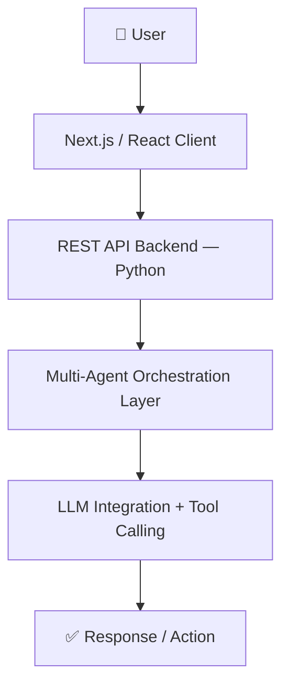

# 🧠 NeuraBoardAI — Full-Stack AI Application

> Currently in active development. Private repo.

## What it is
NeuraBoardAI is a full-stack AI product built from zero — 
combining a multi-agent orchestration layer, REST API backend, 
and real-time client interface into a single cohesive product.

---

## Architecture

---

## Tech Stack

| Layer | Tools |
|---|---|
| Frontend | Next.js · React · TypeScript |
| Backend | Python · REST APIs |
| AI Layer | LLM orchestration · multi-agent workflows |
| Dev | Git · VS Code · Cursor |

---

## Status
🔨 Actively building — shipping toward first users.  
📩 Interested? Reach out: [darius.farcas56@gmail.com](mailto:darius.farcas56@gmail.com) [fifilukasiewicz@gmail.com](mailto:fifilukasiewicz@gmail.com)

---

*Built and maintained by Darius-Alexandru Farcas & Filip Lukasiewicz — Milan, 2026*
